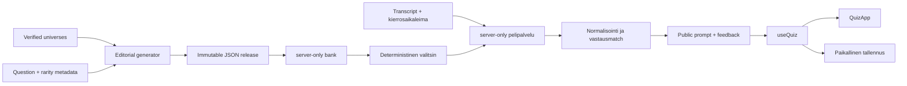

# Arkkitehtuuri

Mylvisa pitää pelin säännöt React-esityksestä erillään:

## Luottamusraja

`src/data/releases.ts`, `src/lib/server/bank.ts` ja `src/lib/server/game.ts` ovat server-only-koodia. Ennen vastausta DTO:ssa on vain `id`, `prompt`, `category`, `universeId` ja kierrosnumero. Vastauksen jälkeen palautetaan pelaajan oma syöte, hyväksytty kanoninen nimi ja tier tai yhdellä esimerkkivastauksella varustettu hylkäyspalaute. Koko hyväksyttyjen vastausten lista, aliakset, pistekartta, lähteet ja kaikki korkean arvon vastaukset eivät ylitä rajaa.

Tuotantobuildin `scripts/check-client-bundle.ts` tarkistaa promptit, selitykset ja riittävän pitkät kanoniset vastaukset JavaScript- ja source map -tiedostoista. Repositoryn lukija näkee JSON:n GitHubissa; tämä suojaa pelaamista selaimen ennakkolataukselta, ei julkista lähdekoodia vastaan.

## Pyyntöprotokolla

`GET /api/quiz` palauttaa päivän ensimmäisen promptin sekä palvelimen aikaleimat. `POST /api/quiz` ottaa `{ date, mode, answers, releaseId?, roundStartedAt? }`. `answers` on järjestyksessä lähetetty transcript; palvelin laskee tulokset uudelleen jokaisella pyynnöllä. Zod hylkää ylimääräiset kentät, 160 merkkiä pidemmät syötteet ja liian pitkät transcriptit.

`roundStartedAt` on preview-vaiheen alku. Palvelin käsittelee koko 3 + 25 sekunnin ikkunan absoluuttisena deadlinena ja korvaa viimeisen myöhästyneen syötteen tyhjällä vastauksella. Asiakas käyttää samaa deadlinea, tarkistaa ajan näkyviin palatessa ja lukitsee kierroksen heti. Web Locks ja v2-paikallistallennus estävät tavalliset tuplalähetykset yhteistyössä toimivissa välilehdissä.

## Päivävalinta

Valitsin käyttää Helsinki-päivää, release-snapshotia ja versionoitua FNV-1a-hajautusta. Yksi sykli on `floor(activeCount / length)` päivää. Sykli replayataan pyydettyyn päivään asti, ja jokaisella slotilla suositaan käyttämätöntä kysymystä, uutta universumia ja uutta kategoriaa. Syötearrayta ei muuteta, eikä `Math.random()` ole mukana. Saman päivän järjestys on sama kaikille prosesseille.

Kysymysten `validFrom` ja `validUntil` ovat kalenteripäiviä. Vanhentunut tai tulevaisuuden kysymys ei pääse valintaan. Muuttunut algoritmi julkaistaan uutena valitsinversiona; jo voimaan tulleen releasen JSON:ia ei muokata.

## Tila ja tulevaisuus

`useQuiz`-tilat ovat `home → preview → question → feedback → … → complete`. Paikallinen tallennus palauttaa keskeneräisen kierroksen aikaleiman ja valmistuneen tuloksen. Tallennuksen puuttuminen näyttää ilmoituksen, mutta ei estä pelaamista.

Stateless transcript on MVP:n tietoinen rajoitus. Tilin, globaalin tulostaulun ja yhden yrityksen palvelineston lisäämiseksi luodaan palvelinpuolen `attempt`-tietue, jossa säilytetään release-, valitsin- ja kysymys-ID:t sekä idempotenssiavain. Pure functions (`selectDailyQuestions`, `matchAnswer`, `evaluateAnswer`) säilyvät samoina.

## Sisältödata

Jäsenyys ja pisteytys ovat erillisiä: `src/data/universes.ts` sisältää lähde-backed complete universet ja `src/data/question-authorship.ts` suomalaisille pelaajille tehdyt promptit sekä jäsen-ID:ihin sidotut editorial scoret. Generatorin fail-closed-tarkistukset estävät tuntemattomat jäsenet, väärät expected countit, aliastörmäykset, puuttuvat pisteet ja osittaisen universumin hiljaisen julkaisun.

`validateBank` tarkistaa lisäksi release-JSON:n ja universe-rekisterin välisen jäsenyysjoukon, lähteen, viitepäivän, review-statukset ja score-histogrammit. Se ei hyväksy aktiivista kysymystä, jonka completeness ei ole `verified`; kuuden tierin pakottaminen on poistettu.
