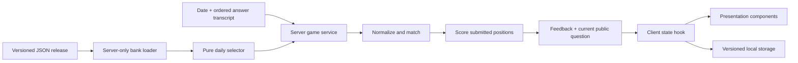

# Architecture and integrity boundaries

## Data flow

The client never imports a bank or the matcher. Shared client modules contain only dates, labels, public types and persistence/sharing utilities. Server-only guards make accidental runtime imports fail a Next.js build. Tests importing the service replace only the guard with an empty test module; the production build retains it.

## Attempt protocol

The MVP has a stateless server. Every request includes the answer transcript in question order. The server independently chooses the applicable immutable release and question set, checks payload sizes and validity, and computes the result. Unknown score fields and arbitrary IDs are rejected. The response includes only the current prompt/category/number/ID and feedback for submitted questions. It never includes aliases or per-answer scoring tables. Source metadata and difficulty remain server-side.

The transcript design supports retry after transport failure without duplicate server-side writes. Local storage records start state, submitted answers, feedback position, and the completed response under `mylvisa:v1:YYYY-MM-DD`. Restoration recomputes the result on the server instead of trusting stored points. Storage failures produce a visible warning and do not prevent play. Web Locks serialize daily submissions across cooperating tabs where supported, and storage events synchronize progress.

**This is not a tamper-proof attempt ledger.** Requests can be replayed with different answers, local state can be deleted, and the server has no identity or durable attempt counter. Keeping the answers out of pre-submit responses protects ordinary play, not malicious scraping. A public repository also exposes the source bank to anyone who visits GitHub. Do not add competitive rewards on top of local state.

## State and rollover

Client phases are `home → question → feedback → question … → feedback → complete`. Network errors leave the current answer editable and retryable. Loading/restoration uses a generation counter to ignore superseded responses. The API's server timestamp anchors the next-midnight timer; foreground/visibility checks catch a sleeping device. Late daily submissions return HTTP 409 (`DAY_CHANGED`). The client restores a completed result for today's date or starts the new day. At midnight an unfinished daily attempt closes; the former date can then be practised without points.

Practice is limited to dates strictly earlier than today, at most 30 days old, and no earlier than the first release. Practice does not read or overwrite daily storage and returns zero points/maximums. Its state is intentionally temporary.

## Release stability and selection

Content snapshots are immutable after their effective date. A later snapshot changes only later dates. The current single selection engine is explicitly named `deck-v1`; changing its behavior for existing snapshots would change historical quizzes, so introduce a version dispatch and retain `deck-v1` before future algorithm changes.

Cycles are based on the release's active record count, not a user's input or the current eligible count. This keeps boundaries fixed when validity periods open/close. Each requested cycle is replayed deterministically, with no mutable global schedule or runtime randomness. Draws prefer unused IDs, remaining difficulty quotas, and unique categories. All filtering and selection operate on new arrays/sets.

Within a full evergreen seed cycle, all 112 questions are used once. Scarce difficulty quotas use largest remainders, giving this bank three easy, three medium and one hard question each day. In a depleted deck, repeated categories may be necessary; near a cycle reset, questions may recur sooner. Validity filtering takes priority over repetition avoidance. A bank with fewer eligible questions than the configured length fails safely instead of sending partial quizzes.

## HTTP and rendering

Only `GET`/`POST` are implemented on `/api/quiz`. Input is parsed through strict Zod objects. The body is limited to 24 KB by counting streamed bytes; individual answers to 160 characters and transcripts to 30 positions (and then to the release's actual length). Cross-origin browser requests are rejected; no permissive CORS header is set. Quiz data is served with `private, no-store` headers. There is no shared response cache containing user answers.

Headers prevent framing, MIME sniffing and object embedding, restrict browser capabilities and set a conservative referrer policy. The CSP deliberately covers framing/objects/base/form destinations, but is not a full nonce-based script policy. No raw HTML rendering, dynamic code execution, external content fetch, tracking script or secret is used by the app. A future richer content renderer needs a separate XSS review.

Vercel provides the managed Node runtime and network perimeter. Distributed rate limiting is deliberately outside this infrastructure-free MVP; implement it alongside durable attempts before enabling competitive features or handling abuse at scale.

## Verification

- Unit/property-style examples: Finnish calendar/DST, deterministic order, cycle boundaries, no duplicates or mutation, category/difficulty distribution, validity periods, normalization, score tiers, invalid bank data and alias collisions.
- Service/HTTP tests: exact pre-submit DTO, progressive disclosure, complete score, strict payload, origin/body/type checks, stale dates and practice restrictions.
- Browser tests: complete mixed-score play, saved progress/completion, clipboard fallback, archive isolation, keyboard focus, storage failure, request retry, server-clock rollover and axe accessibility scans at mobile/desktop sizes.
- Production build plus client-asset scan: no question-bank text or explanations in public JavaScript/source maps.

## Future accounts, database and leaderboards

Keep `Question`, `selectDailyQuestions`, normalization and scoring pure. Add a repository interface around server-owned attempts, then replace the transcript submission with `{ attemptId, questionPosition, answer, idempotencyKey }`. Store the release/engine version and chosen question IDs when the attempt starts. Atomically reject already-answered positions and enforce one daily attempt per authenticated user or anonymous signed session. Return the same presentation DTO.

Only server-computed, durable completed attempts should enter a leaderboard. Add explicit retention/privacy rules, abuse controls, account deletion, and verified score provenance. Local persistence can remain a fast UI cache. A bank editor or CMS should export reviewed, immutable snapshots into the existing validation pipeline.
