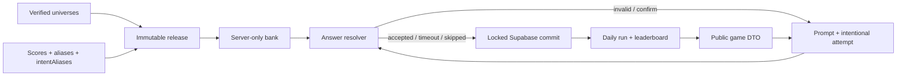

# Arkkitehtuuri

Mylvisa erottaa server-only-kysymyspankin, auktoritatiivisen Daily-runin ja React-esityksen:

## Luottamusraja

`src/data/releases.ts`, release-JSON, `src/lib/server/bank.ts`, resolver ja run engine ovat server-only-koodia. Ennen vastausta selain saa vain kysymyksen ID:n, promptin, kategorian, numeron ja universumin tunnisteen. Kanoniset nimet, tavalliset aliakset, intent-aliakset, pistekartat, lähteet ja vaihtoehtoiset vastaukset eivät ylitä rajaa.

Invalid-vastaus palauttaa vain yleisen virheen. Confirm palauttaa yhden kanonisen näyttönimen ja salatun tokenin ilman pisteitä tai rarityä. Vasta terminaalinen accepted-tulos palauttaa pelaajan oman syötteen, kanonisen nimen, pisteet ja tierin. Client leak scan etsii production-JavaScriptistä ja source mapeista promptit, kanoniset nimet, molemmat aliastyypit ja rarity-tietueet.

Repositoryn lukija voi nähdä release-JSON:n GitHubissa. Suojaus estää tavallista selaimen kautta tapahtuvaa ennakkolatausta ja enumerointia; se ei väitä tekevänsä julkisesta lähdekoodista salaista.

## Daily-run ja tilakone

Tuotannon tila on `READY → PREVIEW → ANSWERING → (INVALID | CONFIRM) → ANSWERING → ACCEPTED | TIMEOUT | SKIPPED → PROGRESSION → RESULT_READY`. Kierrosten välissä ei ole ajastettua pakkoa: pelaaja avaa seuraavan kierroksen itse. Seitsemännen tuloksen jälkeen UI avaa täydellisen recapin.

Supabasen `daily_runs` sisältää yhden rivin per käyttäjä ja Helsinki-päivä. `round_started_at` määrittää 3 sekunnin previewn ja sitä seuraavan 25 sekunnin vastausajan absoluuttisen deadlinen. Invalid ja confirm ovat ephemeraaleja eivätkä muuta runia, versiota tai deadlinea. Accepted, timeout ja skip lisäävät täsmälleen yhden terminaalituloksen.

`mylvisa_commit_run` lukitsee rivin, vertaa `expected_version`-arvoa ja validoi muuttumattomat release- ja kysymys-ID:t, uuden kierroksen outcome-tyypin, pisteet, laskurit, aikaleimat ja completion-tilan. Ensimmäinen terminaalinen kirjoitus voittaa; tupla-Enter, kaksi välilehteä tai viivästynyt vastaus saa takaisin tallennetun uudemman tilan. Invalid/confirm-vastauksen jälkeen palvelin lukee runin uudelleen, jotta rinnakkainen terminaalinen commit ei peity vanhaan ephemeral-vastaukseen.

Run säilyttää hyväksytyn syötteen recapin vuoksi sekä kanonisen entity-ID:n. Invalid-vapaatekstiä ei tallenneta. Timeout ja skip eivät sisällä syötettä. Leaderboard käyttää vain auktoritatiivista 0–700 pistemäärää; MYLV johdetaan esityksessä kertoimella 10.

## Resolver

Direct match kattaa kanonisen nimen, eksplisiittisen alias-muodon, normalisoinnin ja yhden yksiselitteisen vierekkäisen merkkivaihdon. Kysymyskohtainen intent-alias tuottaa confirm-tilan vain kokonaisen normalisoidun ilmauksen täsmäosumasta. Prefix-, substring-, Levenshtein-, embedding- ja typeahead-hakuja ei ole.

AES-256-GCM-confirmation token sitoo runin, käyttäjän, kysymyksen, version, alkuperäissyötteen, kanonisen entity-ID:n ja deadlinen. Serveri ei luota clientin lähettämään entity-ID:hen. Yksityiskohdat: [answer-resolution.md](answer-resolution.md).

## Release ja päivävalinta

Valitsin käyttää Helsinki-päivää, immuuttia release-snapshotia ja versionoitua FNV-1a-hajautusta. Uusi run saa päivälle uusimman voimaan tulleen releasen. Jo aloitettu run avataan aina omalla `release_id`:llään, joten kesken päivän julkaisu ei vaihda kysymyksiä, pisteitä tai resolver-dataa.

Kysymysten `validFrom` ja `validUntil` ovat kalenteripäiviä. Valinta käyttää seitsemää eri semantic familya ja rajoittaa kategoriakeskittymiä. `validateBank` tarkistaa release-jäsenyyden, lähteet, review-statukset, rarity-histogrammit sekä direct- ja intent-aliasten törmäykset.

## Paikallinen harjoitus

`POST /api/quiz` käsittelee harjoituksen ja backendittömän paikallisen fallbackin samalla resolver-sopimuksella. Selain lähettää oman terminaalisen transcriptinsa, outcome-listan, aktiivisen kierroksen alkuperäisen `roundStartedAt`-ajan ja yhden `attempt`-olion. Invalid/confirm eivät lisäänny transcriptiin. LocalStorage v3 säilyttää vain terminaaliset vastaukset/outcomet ja aktiivisen kellon. Harjoitus ei vaikuta profiiliin tai leaderboardiin.

## Esitys ja saavutettavuus

`useQuiz` hallitsee tilat, palvelimen kellon synkronoinnin, yhden aktiivisen verkkopyynnön, Web Locks -yhteistyön ja progression ajoituksen. `QuizApp` näyttää yhden päätöksen kerrallaan. Mylvintäaalto käyttää vaakasuuntaista maiseman liikettä, score/MYLV-laskureita ja milestone-tekstiä. Reduced-motion vaihtaa tiedon välittömästi uuteen tilaan ilman etenemismerkityksen poistamista. Katso [mylvinta-progression.md](mylvinta-progression.md).
